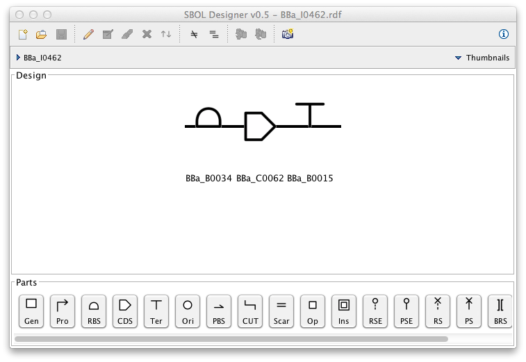

SBOL designer allows you to visualize [SBOL](http://www.sbolstandard.org/) designs using SBOL visual icons, edit SBOL designs 
in a GUI, import DNA components from an SBOL parts registry, and save your design an SBOL RDF/XML
file.

SBOL Designer can be used either as a standalone program or a as a [Geneious](http://www.geneious.com/) plugin.

## Running SBOL Designer stand-alone

SBOL designer requires Java 6 or later to be installed on your computer. To run SBOL designer, 
simply double click the jar file. If your OS does not support running Java applications by
double clicking, you can run the designer from command-line by using the `java -jar <jarFileName>`
command at a terminal where `jarFileName` will be the name of the SBOL Designer jar file you
downloaded.

 
## Using SBOL Designer plugin in Geneious

SBOL Designer plugin has been tested with Geneious 5.5 and later. To install the plugin, start
Geneious, go to Tools->Plugins menu option, click "Install plugin from a gplugin file" and select 
the SBOL designer gplugin file. The plugin will be ready to use immediately.

If you download a newer version of the plugin at a later time you can follow the same steps and
the new version of the plugin will replace the old version.

## License

SBOL Designer is currently available as closed-source software but can be used free of charge accrding to its
[license](https://github.com/clarkparsia/sbol/blob/master/LICENSE.txt).  

## Acknowledgements

SBOL designer is developed by [Clark & Parsia, LLC](http://clarkparsia.com) in conjunction 
with [University of Washington](http://www.washington.edu). Special thanks to 
[John Gennari](http://faculty.washington.edu/gennari/), [Michal Galdzicki](http://faculty.washington.edu/mgaldzic/),
[Herbert Sauro](http://depts.washington.edu/bioe/people/core/sauro.html), and Bryan Bartley.

